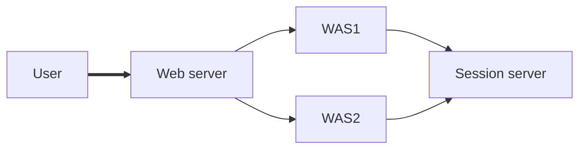
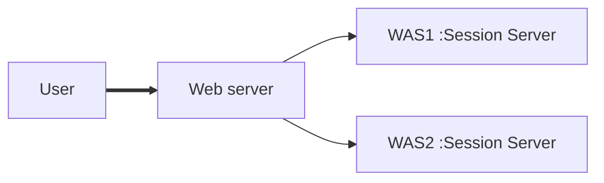

# Clustering

## Session & Cookie & Clustering

http에서 session은 사용자 하나하나를 구분할 수 없고, 상태를 알 수도 없다.

신원확인을 위해 cookie를 사용한다.

WAS를 이중화를 해 놓는다면 아래와 같은 모양새가 된다.


graph LR;
	A[User] --> B[WAS1];
	A --> C[WAS2];


User는 WAS1에 붙어있다가 문제가 생기면 WAS2에 연결되게 되는데, 로그인 등을 한 상태라면 이 상태를 가지고 그대로 작업을 가능하게 해야 한다.

이를 위해서 하는 것이 클러스터링이다.

User가 WAS1에서 쿠키를 받고 작업을 하다가 WAS1과의 연결이 끊어지면 user가 WAS1의 쿠키정보를 그대로 들고 WAS2로 갔을 때 작업이 가능해야 한다.

하지만 Weblogic의 경우, 위의 그림과 같은 상태일 때 계속해서 새로고침을 하면 Session ID나 쿠키값이 계속 달라지는 것을 볼 수 있다.

이는 새로고침 할 때마다 서버가 User를 각기 다른 사람으로 인식하기 때문이다.

이를 위해 Web server를 사이에 설치해 준다.


graph LR;
A[User] ==> B[Web server];
B --> C[WAS1];
B --> D[WAS2];


User는 새로고침을 하더라도 Web server가 쿠키값을 보고 User를 한 사람으로 인식하고 적절한 WAS로 load balancing 시켜주게 된다.

또한 WAS들은 계속 같은 Web Server에 연결되어 있기 때문에 새로고침 때문에 User를 다른 사람으로 인식할 일이 없다.

### JEUS의 경우

JEUS6까지 Session server가 따로 존재했었다. 쿠키정보를 Session server에 저장해 두었다.

user와 session연결이 되었을 때마다 session server의 쿠키값을 확인하는 방식이었다.

JEUS7에 와서는 Session server가 사라졌다. 분산처리하는 방식으로 바뀌었기 때문이다.

각 WAS에 session server를 두고 공유하는 방식으로 바뀌었다.

(모두 공유하지 않는다. MS 4개가 있으면, primary server는 하나의 서버만 backup server로 삼는다. 모두 공유하면 리소스 낭비이므로)

### Primary / Secondary(==backup)

보통 User와 최초 연결되는 서버가 Primary, 나머지 이중화 서버가 Secondary가 된다.

Client가 primary 서버과 failover 되었을 때

WebLogic의 경우: secondary를 바로 primary로 삼고 작업을 진행

JEUS의 경우: 가장 가까운, 가령 third server에 가서 primary에게 다시한번 연결요청을 한다. 그래도 연결요청이 실패하면 secondary와 연결한다

### Failover

MS1에서 문제가 발생했을 때, MS2로 역할을 넘기면서 장애를 **극복**

### Failback

장애상황 이후, MS1이 MS2로부터 **역할을 회복**

## Rolling Restart

클러스터링 된 4개의 MS A, B, C, D

유저가 A에 연결되어 있는 상태. Primary server A, Secondary(backup) server C

ABCD 차례차례 재기동시키면, 세션이 유지가 될까?

- 원래는 세션이 유지되지 않는다
- JEUS의 경우, 세션에 연결되어 있는 사용자가 재기동 하는 중에 "타이밍 좋게 세션을 다시 신청하지 않았다"면, 세션은 끊어진다.
  - 세션을 새로 만드는 트리거는 사용자이지(새로고침 등), 운영자가 단순 재기동하는 행위는 세션을 다시 만들지 않기 때문이다.
- 세션 유지가 되게끔 만든 JEUS의 기능: Failback
  - 세션이 있던 A를 죽임 -> B로 failover -> B가 계속 A를 주시 -> A가 살아나면 B가 본인이 가지고 있는 모든 정보(세션, 쿠키정보 등)을 A로 밀어넣는다.

## Config

Jeus -> Servers -> [서버 선택] -> Engine -> Session Config
Shared에 체크
고급 선택사항 -> Tracking Mode: Cookie에 체크
Session Cookie -> Domain 설정하기

